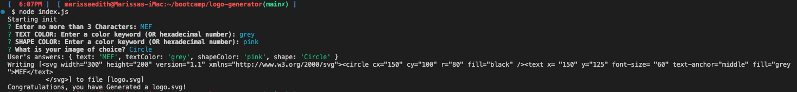

#  SVG Logo Maker

## The Challenge

Build a Node.js command-line application that takes in user inputs to generates a SVG logo and saves it as "logo.svg" file. In addition, create a walkthrough video that demonstrates its functionality and the passing of all of the tests.
### User Story

```md
AS a freelance web developer
I WANT to generate a simple logo for my projects
SO THAT I don't have to pay a graphic designer
```

## Acceptance Criteria

```md
GIVEN a command-line application that accepts user input
WHEN I am prompted for text
THEN I can enter up to three characters
WHEN I am prompted for the text color
THEN I can enter a color keyword (OR a hexadecimal number)
WHEN I am prompted for a shape
THEN I am presented with a list of shapes to choose from: circle, triangle, and square
WHEN I am prompted for the shape's color
THEN I can enter a color keyword (OR a hexadecimal number)
WHEN I have entered input for all the prompts
THEN an SVG file is created named `logo.svg`
AND the output text "Generated logo.svg" is printed in the command line
WHEN I open the `logo.svg` file in a browser
THEN I am shown a 300x200 pixel image that matches the criteria I entered
```

## Walkthrough Video
[](https://youtu.be/SarMQvgZp6A)

URL to walkthrough video on YT: https://youtu.be/SarMQvgZp6A

## Screenshots

## Figure 1. Command line application


## Figure 2. Generated Logo Sample


